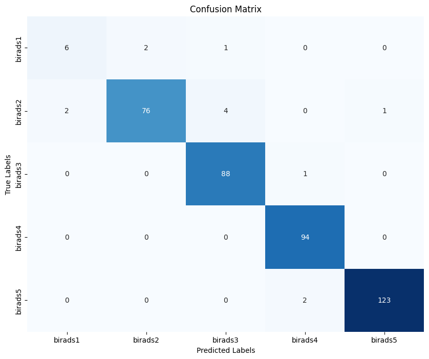

# Radyoloji Raporlarından BI-RADS Sınıflandırma ve Varlık İsmi Çıkarımı 

Bu proje şunları içermektedir, **Mamografi Radyoloji Raporlarından BI-RADS Sınıflandırması** ve **Mamografi Radyoloji Raporlarından Varlık İsmi Çıkarımı**.

## 📌 Özellikler
- **Türkçeye Özel Ön İşleme**: Tıbbi metinler için özel veri temizleme ve normalleştirme..
- **Birçok Model Test Edildi**: En iyi doğruluk oranına sahip model seçildi.
- **Çok Sınıflı BI-RADS Sınıflandırması**: BI-RADS 0-5 arası kategorileri sınıflandırır.
- **Varlık İsmi Çıkarımı (NER)**: Hasta bilgileri, hastalıklar ve semptomları algılar.

## 🛠️ Installation
```bash
git clone Mamografi_Raporlarindan_Bi_Rads_Siniflandirmasi_Ve_NER.git
cd Mamografi_Raporlarindan_Bi_Rads_Siniflandirmasi_Ve_NER
```


## 📊 Sonuçlar - Bi Rads Sınıflandırma
```
-Key Metrics:
-Precision Weighted Avg: 0.97
-Recall Weighted Avg: 0.0.97
-F1 Score Weighted Avg: 0.97
-Test F1 Score: 0.9666

```



## 📊 Sonuçlar - Varlık İsmi Çıkarımı
```
-Key Metrics:
-F1 Score Weighted Avg: 0.9529

```


