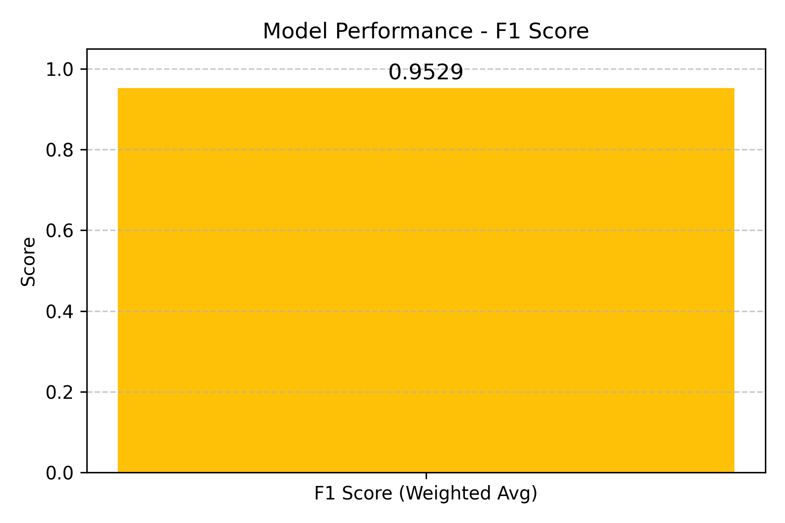
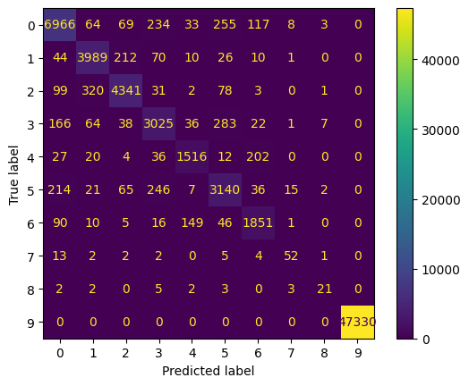
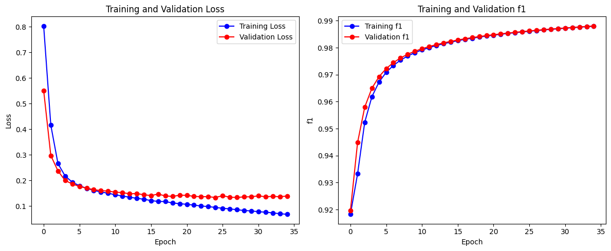

# Mamografi Raporlarında Adlandırılmış Varlık Tanıma (NER)

## 📌 Özellikler
- **Türkçeye Özel Ön İşleme**: Tıbbi metinler için özel veri temizleme ve normalleştirme..
- **Birçok Model Test Edildi**: En iyi doğruluk oranına sahip model seçildi.
- **Varlık İsmi Çıkarımı (NER)**: Hasta bilgileri, hastalıklar ve semptomları algılar.


## 🛠️ Installation
```bash
git clone Mamografi-Raporlarinda-Adlandirilmis-Varlik-Tanima-NER.git
cd Mamografi-Raporlarinda-Adlandirilmis-Varlik-Tanima-NER
```


## 📊 Sonuçlar - Varlık İsmi Çıkarımı

- **F1 Score Bar Chart**: Bar chart shows key performance metric F1 Score



- **Confusion Matrix**: Visual representation of the model's true positives, false positives, true negatives, and false negatives



- **Training - Validation Loss and Training - Validation F1 Score Graphs**: Visual representation of the model's training and validation loss and F1 score, showing learning progression and balance between precision and recall.



## License

[MIT License](LICENSE)
